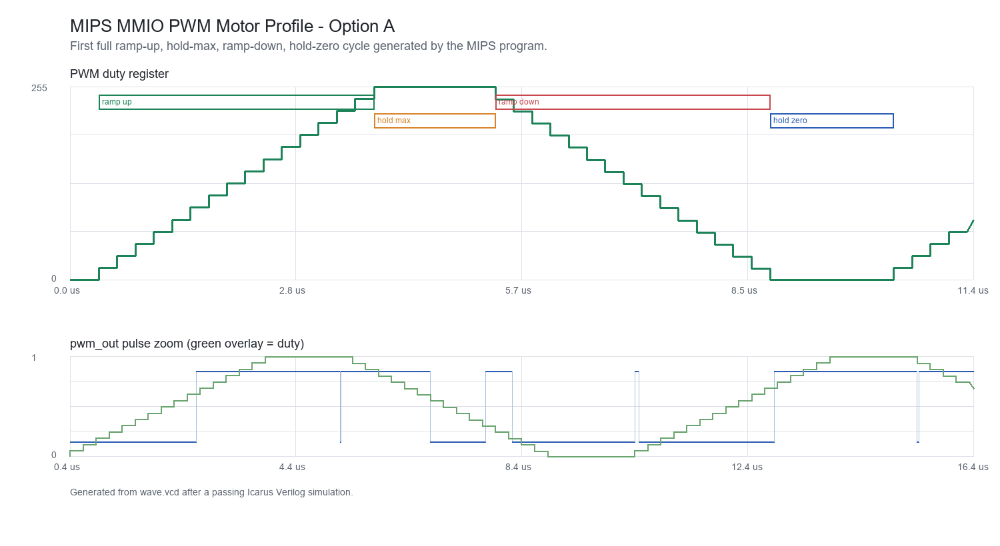

# Test Report: MIPS PWM Motor Controller

## 1. Motor Profile Verification

Implemented option: A, ramp-up -> hold at max -> ramp-down -> hold at 0 -> repeat.

The assembly program first writes `1` to the PWM enable MMIO register at `0x9c`. It then repeatedly writes stepped duty values to the duty register at `0x98`. During ramp-up, the stored duty increases by 16 after each short delay loop. After the ramp reaches the top, the program writes 255 and waits in a longer hold loop. During ramp-down, the duty decreases by 16 until it crosses below zero, then the program writes 0 and waits in the zero-duty hold loop before jumping back to the beginning.

## 2. Edge Cases Tested

Enable = 0: reset clears `pwm_enable`, so `pwm_out` remains low before the program enables PWM through MMIO.

Duty = 0: when `pwm_duty` is 0, `counter < duty` is always false and `pwm_out` stays low.

Duty = 255: when `pwm_duty` is 255, `pwm_out` is high for 255 out of 256 counter values, which appears as an almost fully high pulse train.

Reset mid-ramp: the asynchronous reset path clears the PC, pipeline registers, `pwm_duty`, and `pwm_enable`. After reset is released, the program restarts at address 0, enables PWM again, and begins the ramp from duty 0.

## 3. Build And Simulation Result

The testbench runs the CPU long enough to observe multiple duty updates. It checks that duty both rises and falls, that many duty changes occur, and that `pwm_out` toggles after PWM is enabled. A passing run prints a `TEST PASS` message and writes `wave.vcd` for inspection in GTKWave.
